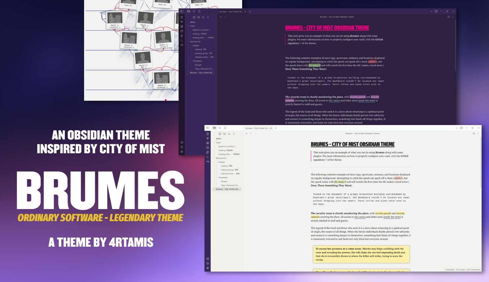
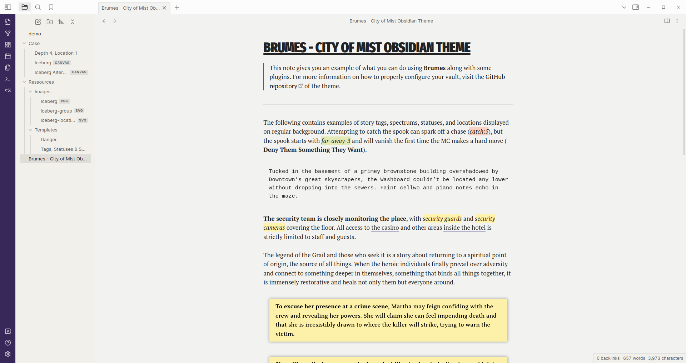
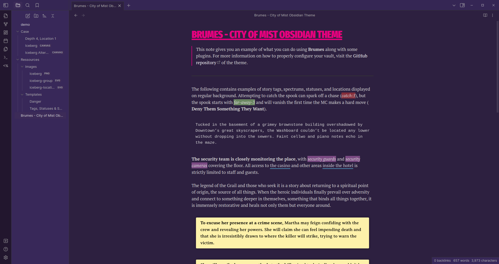
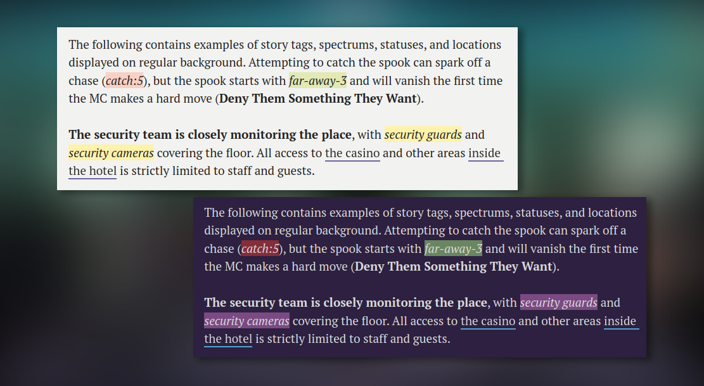
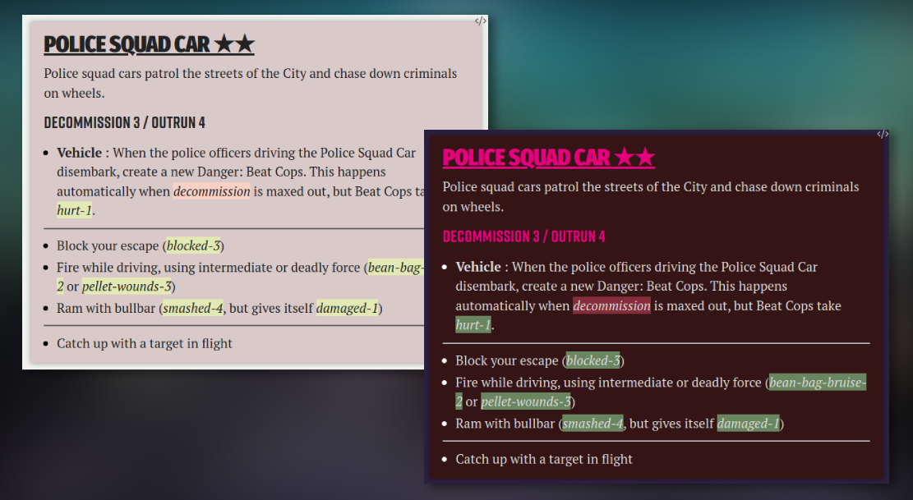
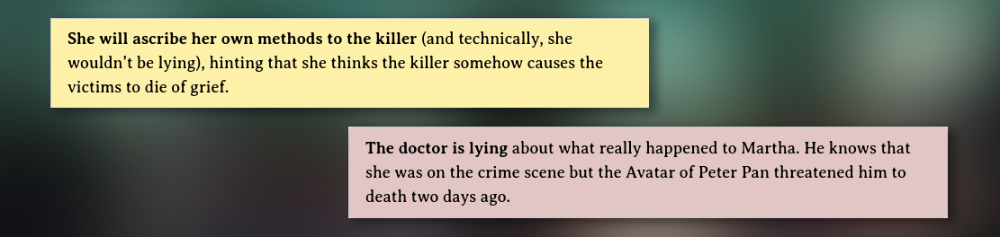
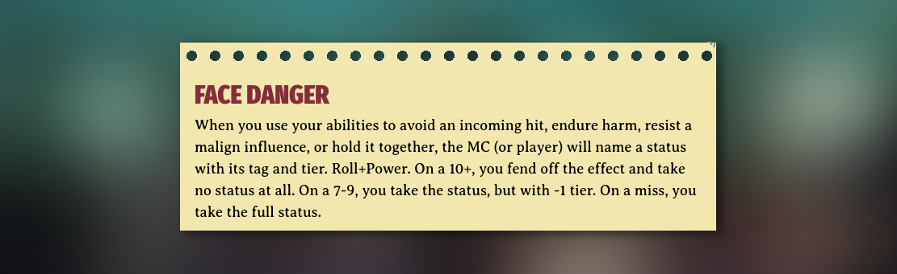
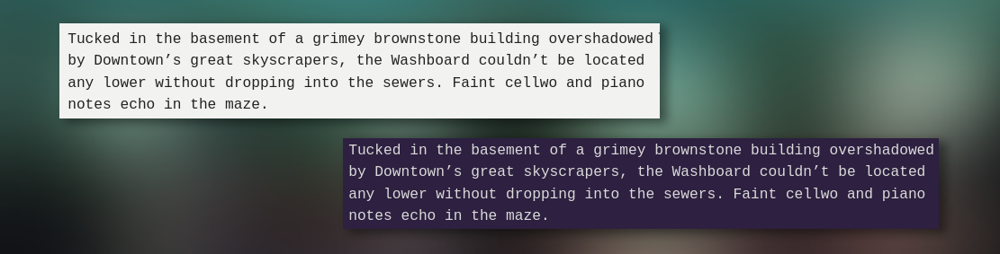
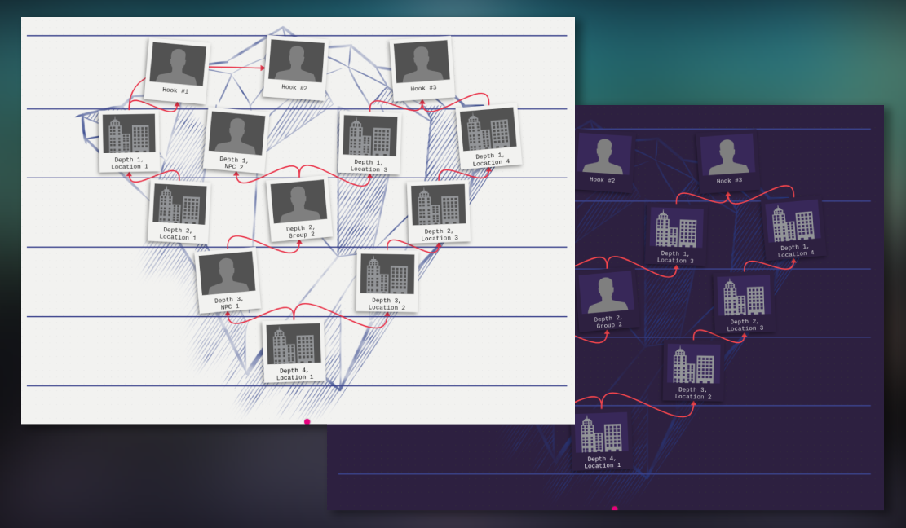
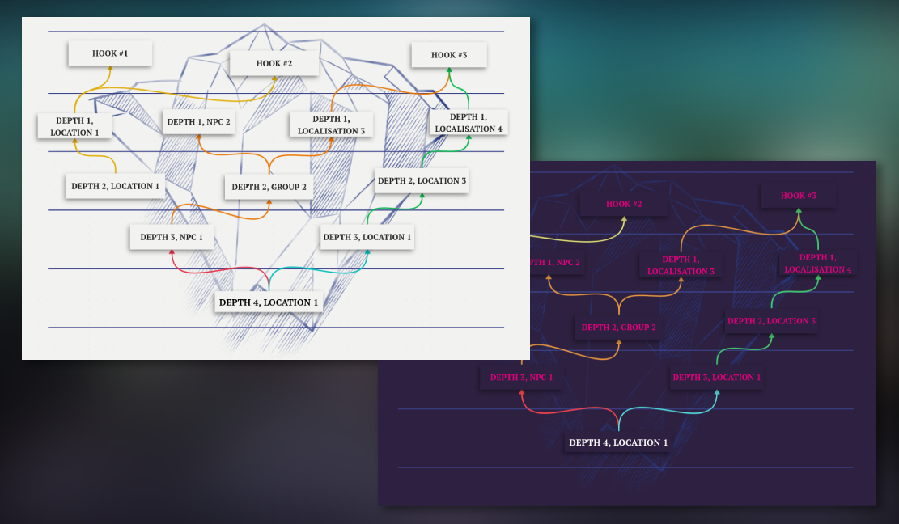

# Brumes - City of Mist Obsidian Theme

Brumes is an [Obsidian](https://obsidian.md) theme based on the award-winning tabletop role-playing game [City of Mist](https://cityofmist.co/). It aims to imitate the overall style of the City of Mist rulebooks and to provide easy-to-use features for the MC to easily prepare her cases.

## Credits

This theme is developed by [**@4rtamis**](https://github.com/4rtamis).

City of Mist is a game created by **Amít Moshe**. This theme is heavily based on the [City of Mist - Style Guide](https://preview.drivethrurpg.com/en/product/363318/city-of-mist-garage-style-guide) published by Son of Oak Game Studio.

The workflow and the Gruntfile used to develop this theme are based on [@kepano](https://www.buymeacoffee.com/kepano)'s famous [Minimal](https://github.com/kepano/obsidian-minimal) theme.

## About Brumes

-   [Screenshots](#screenshots)
-   [Installation](#installation)
-   [Companion plugins](#companion-plugins)
-   [Features](#features)
    -   [Tags, statuses & spectrums](#tags-statuses--spectrums)
    -   [Dangers](#dangers)
    -   [Clues](#clues)
    -   [Moves](#moves)
    -   [Descriptions](#descriptions)
    -   [Icebergs](#icebergs)
-   [Contibuting](#contributing)
-   [License](#license)
-   [Disclaimer](#disclaimer)

## Screenshots




## Installation

To install Brumes:

1. Create a new `Brumes` folder inside `/PATH/TO/YOUR/VAULT/.obsidian/themes/`.
2. Download `theme.css` and `manifest.json` from the [latest release](https://github.com/4rtamis/obsidian-brumes/releases) and place them inside the new `Brumes` folder.
3. In Obsidian, go to `Settings -> Appearance -> Themes`, and select `Brumes`.

> [!NOTE]
> Brumes embeds all the needed assets and fonts. However, the **Rift Bold** font used in the style guide is not under a license compatible with open source projects. In this theme, **Rift Bold** is replaced with **Bebas Kai**. If you want to use **Rift Bold** nonetheless, you need to install it on your system separately (follow this [link](https://www.dafontfree.co/rift-font-family-free/)). Brumes will automatically detect **Rift** and use it instead of the embedded font.

## Companion plugins

The following plugins should be installed alongside Brumes:

-   [Templater](https://github.com/SilentVoid13/Templater) is a community plugin that defines a powerful templating language right inside Obsidian. It is used to facilitate the creation of **dangers**, **tags**, **statuses** and **spectrums**.
-   [Canvas CSS Class](https://github.com/Lisandra-dev/obsidian-canvas-css-class) is a community plugin that can add CSS classes to canvas. It is especially useful to create **Icebergs**.

### Templater

You can install Templater via the Community Plugins tab within Obsidian.

Go to `Settings -> Community plugins -> Browse`. You might need to turn off "Restricted mode". Simply search for "Templater" and install it. You can restart the Obsidian app after the installation to make sure everything is working properly.

> [!NOTE]
> Templater is used to facilitate the creation of **dangers**, **tags**, **statuses** and **spectrums** inside the editor. Once the plugins are installed, you will need to create a `Templates` folder in which you will paste the actual templates for the aforementioned elements. You can find these templates in the [Features](#features) section. Do not forget to add this folder to Templater settings by going to `Settings -> Community plugins -> Templater -> Options -> Template folder location`.

### Canvas CSS Class

You need to manually install this plugin.

Download the [latest release](https://github.com/Lisandra-dev/obsidian-canvas-css-class/releases) (`canvas-css-class.zip`) and unzip it in the `.obsidian/plugins` folder of your vault.

## Features

Among the common elements of an Obsidian theme (headings, paragraphs, fonts, colors, etc.), Brumes implements some whole new elements that the MC may find useful for preparing City of Mist cases.

### Tags, statuses & spectrums



Brumes enables you to add tags, statuses and spectrums to your Obsidian notes. Use the following HTML blocks whenever you need them:

```html
<mark class="tag">security guards</mark>
<mark class="status">far-away-3</mark>
<mark class="spectrum">catch:5</mark>
```

To facilitate the writing process, you can make use of [Templater](#templater). Inside your templates folder in your vault, create a new note named `Tags, Statuses & Spectrums`. Then, copy and paste the following code:

```js
<%*
selection = tp.file.selection();
const type = await tp.system.suggester(["Tag","Status","Spectrum"], ["tag","status","spectrum"]);

if (type === undefined || type === null) {
	return;
} else {
	return "<mark class='" + type + "'>" + selection + "</mark>";
}
%>
```

Whenever you need to add one of these, you can select the corresponding text and use the shortcut `Alt+E`. Use the prompt to select either the tag, status or spectrum format.

### Dangers



Most of the tense scenes in City of Mist involve one or more dangers. Brumes enables you to create custom Danger blocks using the following HTML code:

```html
<div class="danger bg0">
	<h3>Danger Name ★★★</h3>
	<p>Description of the danger</p>
	<h4>Spectrum 2 / Spectrum 5</h4>
	<ul>
		<li><b>Custom Move</b>: Description of the custom move.</li>
		<li><b>Custom Move</b>: Description of the custom move.</li>
	</ul>
	<hr />
	<ul>
		<li>Major move description</li>
	</ul>
	<hr />
	<ul>
		<li>Minor move description</li>
	</ul>
</div>
```

> [!NOTE]
> There are 8 background colors available for dangers. Simply pick one of the eight corresponding HTML classes at the top of the block: `bg0`, `bg1`, `bg2`, `bg3`, `bg4`, `bg5`, `bg6` or `bg7`.

You can also add the following template to [Templater](#templater). Add a new note named `Danger` to your templates folder. Then copy and paste this code:

```js
<%*
selection = tp.file.selection();
let min = 0;
let max = 7;
let background = Math.floor(Math.random() * (max - min + 1) + min);
return(`
<div class='danger bg${background}'>
	<h3>${selection} ★★★</h3>
	<p>Description of the danger</p>
	<h4>Spectrum 2 / Spectrum 5</h4>
	<ul>
		<li><b>Custom Move</b>: Description of the custom move.</li>
		<li><b>Custom Move</b>: Description of the custom move.</li>
	</ul>
	<hr>
	<ul>
		<li>Hard move description</li>
	</ul>
	<hr>
	<ul>
		<li>Soft move description</li>
	</ul>
</div>
`);
%>
```

Now, you can use `Alt+E` to open the template prompt and select your danger template. Note that every new danger block gets assigned a background color when initialized.

### Clues



As City of Mist is, by essence, an investigation game, clues are crucial when writing cases. Brumes enables the MC to easily add clue blocks in two different styles.

-   **Single case clues** (yellow) are relevant to the currently played case. They are focused on short-term gameplay elements.
-   **Long-term clues** (red) are used to hide clues for the bigger picture. They are especially useful when writing a whole series of cases that are somehow linked to each other.

Brumes makes use of [callouts](https://help.obsidian.md/Editing+and+formatting/Callouts) to design clues. Use the `clue` type identifier for single case clues and the `special-clue` type identifier for long-term clues.

```md
> [!clue] **She will ascribe her own methods to the killer** (and technically, she wouldn’t be lying), hinting that she thinks the killer somehow causes the victims to die of grief.

> [!special-clue] **The doctor is lying** about what really happened to Martha. He knows that she was at the crime scene, but the Avatar of Peter Pan threatened him to death two days ago.
```

### Moves



If needed, the MC can create **custom moves**, specific to a situation or a character. Brumes enables you to format those moves using a [callout](https://help.obsidian.md/Editing+and+formatting/Callouts) with the type identifier `move`.

```md
> [!move] Face Danger
> When you use your abilities to avoid an incoming hit, endure harm, resist a malign influence, or hold it together, the MC (or player) will name a status with its tag and tier. Roll+Power. On a 10+, you fend off the effect and take no status at all. On a 7-9, you take the status, but with -1 tier. On a miss, you take the full status.
```

### Descriptions



If you need to prepare some paragraphs to read aloud when your players enter a specific location, or if you need to write beforehand the voiceover that will start the next session, you can use a description block.

Brumes uses the custom [callout](https://help.obsidian.md/Editing+and+formatting/Callouts) type identifier `description` to create such blocks in Markdown.

```md
> [!description] Tucked in the basement of a grimey brownstone building overshadowed by Downtown’s great skyscrapers, the Washboard couldn’t be located any lower without dropping into the sewers. Faint cello and piano notes echo in the maze.
```

You can use Templater once more to facilitate the creation of new clues, special clues, moves and description. Create a new page in your templates folder and paste the following code:

```js
<%*
selection = tp.file.selection();
const type = await tp.system.suggester(["Clue","Special Clue","Move","Description"], ["clue","special-clue","move","description"]);

if (type === undefined || type === null) {
	return;
} else {
	return ">[!" + type + "] " + selection;
}
%>
```

Now, you can use `Alt+E` to open the template prompt and select the template you want.

### Icebergs




As explained in the [MC Toolkit](https://cityofmist.co/en-eu/products/mc-toolkit), City of Mist uses the iceberg method to create cases and organizations. Brumes would not be complete if it did not enable the MC to create such icebergs right inside Obsidian.

Brumes takes advantage of the [canvas](https://obsidian.md/canvas) feature of Obsidian to create such icebergs.

#### Setup

You will need to install the [Canvas CSS Class](#canvas-css-class) plugin first. Then create a new canvas wherever you want inside your vault. Open the command prompt (`Ctrl+P`) and find the `Canvas CSS class: Add a CSS Class to the active canvas`. The required class for the theme to be applied is `iceberg`.

> [!WARNING]
> If you ever rename or move the iceberg canvas afterwards, you will need to repeat this process once more. Do not forget to go to `Settings -> Canvas CSS class` to remove the obsolete class.

#### Background

Choose an iceberg background that fits your case / organization (do not worry, you will be able to change afterwards if needed):

-   [Flat Case](./doc/iceberg_backgrounds/iceberg_flat_case.png) (2 depths)
-   [Simple Case](./doc/iceberg_backgrounds/iceberg_simple_case.png) (3 depths)
-   [Average Case](./doc/iceberg_backgrounds/iceberg_average_case.png) (4 depths)
-   [Involved Case](./doc/iceberg_backgrounds/iceberg_involved_case.png) (5 depths)
-   [Blank Iceberg](./doc/iceberg_backgrounds/iceberg_blank.png) (no lines)

Import the chosen background into your vault. In your canvas, right-click and select `Create Group`. Use the toolbar to add the iceberg as a background to the group. Resize it until you like the look of it.

#### Cards

It is now time to fill your iceberg with the NPCs and locations of your case / organization. First, you need to choose which style of iceberg you prefer. Brumes enables the MC to create an iceberg using two cards styles:

-   cards that look almost exactly like the ones in the MC Toolkit (go to [MC Toolkit Cards](#mc-toolkit-cards)) ;
-   simplified cards optimized for readability but further away from City of Mist style (got to [Simple Cards](#simple-cards)).

##### MC Toolkit Cards

First of all, you need to import those two SVGs to your vault:

-   [Location card illustration](./doc/iceberg_cards/iceberg-location.svg)
-   [Group / NPC card illustration](./doc/iceberg_cards/iceberg-group.svg)

Right-click on the canvas and select `Add card`. Then copy and paste the following markdown inside your card:

```
---
cssclass: iceberg-card rot-2
---
![[iceberg-location.svg]]
[[INSERT CARD NAME]]
```

-   The `iceberg-card` class enables Brumes to apply the correct styling to your card. Do not remove it.
-   The `rotX` class modifies the rotation of the card. You can replace the `X` with any value between -5 and 5 (ex: `rot4`, `rot-1`, etc.).
-   Change the image name depending on the type of card you want, either `![[iceberg-location.svg]]` for locations or `![[iceberg-group.svg]]` for an NPC / group.
-   Change the card name according to your needs. The template uses an [internal link](https://help.obsidian.md/Linking+notes+and+files/Internal+links) for the name, but it is optional.

Once the card is not in editor mode, you should be able to resize it to a square-like card. Resize the background group so it all fits in shapes and sizes.

For the next cards, simply copy and paste the first one. When creating connections between cards, I advise making them red to fit the overall theme.

##### Simple Cards

These cards are optimized for readability and make the most of the canvas feature of Obsidian.

Right click on the canvas and select `Add card`. Use the very first line to write the name of your card using a level 5 title:

```md
##### Insert Title Here
```

Optionally, you can use [internal link](https://help.obsidian.md/Linking+notes+and+files/Internal+links) to reference other notes in your vault:

```md
##### [[Insert Title Here]]
```

Connect the cards using the canvas built-in feature. I advise using different colors to represent the different branches of the iceberg. You can also edit the background color of your cards.

## Contributing

I first created this theme for my personal use of Obsidian when designing City of Mist cases. Some parts of the theme are poorly designed and I believe there are many ways to improve the foundation I developed.

If you would like to propose new features, improvements, corrections, support for plugins or report a bug, do not hesitate to open a pull request.

If you have any questions, you will likely find some help on the [City of Mist RPG Discord](https://discord.gg/jH686wH) (tag me in the appropriate channel, for instance).

### Developers

In order to start working on this theme, create a fork of it and clone it on your computer. Please use new branches for contributions.

#### Set up

You will need [NodeJS](https://nodejs.org/en) (and npm) to install the packages and [Ruby](https://www.ruby-lang.org) (and gem) to install the sass compiler I use.

The first time you open the project, you can use the following setup if you are on Linux. You should be able to adapt it easily for other OS (like Windows).

```bash
sudo gem install sass
npm install -g grunt-cli
```

Then, open a terminal inside the root directory of the project and run:

```bash
npm install
```

#### Workflow

Create an Obsidian vault to live-test your modifications. Optionally, you can use the [one provided in the repository](./demo/). Then, copy `.env.example` and rename it to `.env`. Change the OBSIDIAN_PATH value to the path of your test vault theme folder (the path should end with `/.obsidian/themes/`)

Open a terminal and type:

```bash
grunt
```

This will start a [GruntJS](https://gruntjs.com/) task runner that will automatically compile when saving any CSS or SCSS file from the `src` directory. It creates two files: `theme.css`, which is the distribution file, and `Brumes.css`, which is an unminified copy of the theme.

#### Submit your changes

Once you are happy with your work, you can submit it to the original Brumes project using a pull request. Please be specific in your commit messages, especially while doing the pull request. Use multiline commit messages when needed.

> [!NOTE]
> Be careful of licenses when adding assets to the theme. Fonts and images need to be embedded in the CSS using Base64, but that does not change the fact that most assets are probably under some license. Some licenses (like MIT) need to appear in the final CSS theme. You can use [`license.css`](./src/css/license.css) to add them to the project.

## License

Brumes is licensed under the [MIT License](./LICENSE) which allows you to modify and redistribute the code. However, you must keep the license notice included in this repository in your CSS file, even if you only extract some parts of the code as standalone snippets. Be careful to include the licenses of the fonts if you embed them in your project as well.

If you distribute a fork of Brumes or any part of the code of this repository, please keep my pseudo and link my GitHub profile page in your Readme.

### Fonts

Brumes embeds in its CSS files the following fonts:

-   Fira Sans Condensed ([OFL License](https://scripts.sil.org/cms/scripts/page.php?site_id=nrsi&id=OFL))
-   PT Serif ([OFL License](https://scripts.sil.org/cms/scripts/page.php?site_id=nrsi&id=OFL))
-   Avería ([OFL License](https://scripts.sil.org/cms/scripts/page.php?site_id=nrsi&id=OFL))
-   Bebas Kai ([OFL License](https://scripts.sil.org/cms/scripts/page.php?site_id=nrsi&id=OFL))

You can find a copy of each of these licenses in the [`FONTS_LICENSES.md`](./FONTS_LICENSES.md) file.

## Disclaimer

Brumes is provided as is and is designed for my personal use of Obsidian. It modifies parts of the software interface and may interfere with some features. There is no guarantee that Brumes will work alongside plugins and CSS snippets other than the ones presented in this document. Furthermore, future updates of Obsidian may break this theme.
