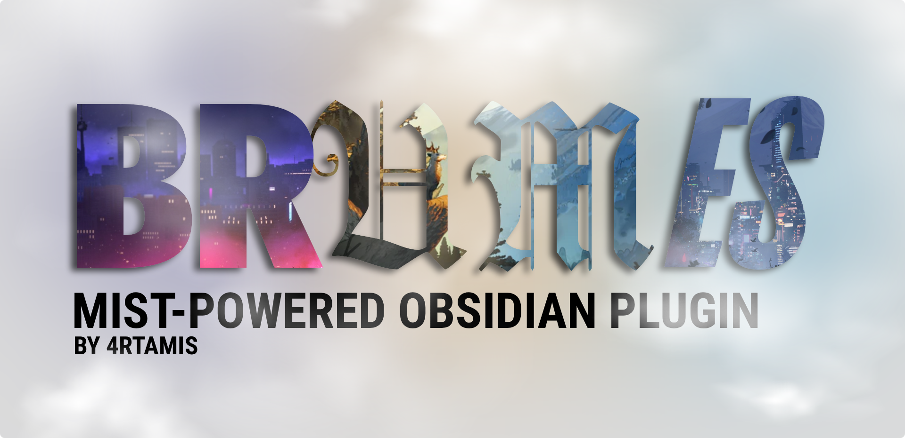

<p align="center">
  
</p>

# Brumes

Brumes is an Obsidian plugin for running **City of Mist** and **Legend in the Mist** vaults with game-specific styling, custom inline syntax, themed callouts, Story Theme cards, and optional canvas helpers.

Note: **:Otherscape** suuport is planned, but not implemented yet.

## Installation

### 1. Prepare a vault

Brumes is easiest to test in a dedicated vault.

| Install                                                                       | Why                                                          |
| ----------------------------------------------------------------------------- | ------------------------------------------------------------ |
| [BRAT](https://github.com/TfTHacker/obsidian42-brat)                          | Required to install Brumes from GitHub                       |
| [Border theme](https://github.com/Akifyss/obsidian-border)                    | The visual base Brumes is designed around                    |
| [Style Settings](https://github.com/mgmeyers/obsidian-style-settings)         | Needed to import the Border preset Brumes provides           |
| [Advanced Canvas](https://github.com/Developer-Mike/obsidian-advanced-canvas) | Optional, only needed for Iceberg and Mountain card snippets |

Suggested vault setup:

1. Create a fresh Obsidian vault for testing or play.
2. Enable Community plugins.
3. Install `BRAT`, `Style Settings`, and optionally `Advanced Canvas`.
4. Switch your theme to `Border`.

### 2. Install Brumes with BRAT

1. Open `Settings -> BRAT`.
2. Choose `Add Beta plugin`.
3. Enter `4rtamis/obsidian-brumes`.
4. Install the plugin, then enable `Brumes`.

### 3. Configure Brumes

1. Open `Settings -> Brumes`.
2. Pick your `Game mode`.
3. Click `Copy preset` for the active mode.
4. Import that preset through `Style Settings` if you are using `Border`.

### 4. Optional canvas setup

If you use `Advanced Canvas`, Brumes can generate mode-specific node-style snippets:

- `City of Mist` mode: copy the `Iceberg canvas snippet`
- `Legend in the Mist` mode: copy the `Mountain canvas snippet`

Then:

1. Go to `Settings -> Appearance -> CSS snippets`.
2. Create `iceberg.css` or `mountain.css` inside `.obsidian/snippets/`.
3. Paste the copied snippet content into the matching file.
4. Enable the snippet in Obsidian.

## Core Concepts

### 1. Custom inline syntax

Brumes parses brace-based syntax in the editor and in reading view:

```md
{power-tag}
{!weakness-tag}
{status-3}
{attention:5}
{countdown:~}
```

- `{power-tag}` creates a normal tag
- `{!weakness-tag}` creates a weakness tag
- `{status-3}` creates a status with a rating
- `{limit:5}` creates a limit

The plugin also adds a Brumes editor context-menu entry so you can insert starter tags, callouts, and Story Theme templates without memorizing the syntax.

### 2. Callouts

Brumes builds on standard Obsidian callouts, but gives them mode-specific styling and aliases.

City of Mist examples:

```md
> [!MOVE] Hit the Streets
> Describe the move here.

> [!DESCRIPTION]
> Text to read aloud.

> [!CLUE]
> The matchbook is still warm.
```

Default City of Mist aliases include:

- `note`, `aside`
- `move`
- `description`, `read-aloud`
- `clue`
- `red-clue`

Legend in the Mist examples:

```md
> [!NOTE] Village Rumor
> The ferryman never crosses after dusk.

> [!READ-ALOUD]
> The mist swallows the road behind you.
```

Default Legend in the Mist aliases include:

- `note`
- `read-aloud`

Aliases are editable in Brumes settings, and the first alias in each list is what the context menu inserts.

### 3. Story Themes for Legend in the Mist

In `Legend in the Mist` mode, Brumes can render a `story-theme` code block into a styled card:

````md
```story-theme
origin
circumstance
{Born in the marsh}
{Track by moonlight}
{Know every hidden trail}
{!Trust strangers too easily}
```
````

How it works:

- First line can be `origin`, `adventure`, or `greatness`
- Second line can be a category or themebook label
- First normal tag becomes the title tag
- Later normal tags become power tags
- `{!weakness}` lines become weakness tags

If you omit the level, Brumes falls back to a standard card style.

### 4. Challenges for Legend in the Mist

In `Legend in the Mist` mode, Brumes can render a `litm-challenge` code block into a challenge profile card:

````md
```litm-challenge
Crafty Rumormonger
roles: Watcher, Sapper, Countdown
: A gossip who turns whispers into weapons.
LIMITS
Convince 2
Scare 2
Undermine Community 4 > Everyone in the community becomes distrustful-2 of one another.
MIGHT
Numbers (caught in a lie)
TAGS
{latest juiciest scandal} chatty confident-2
FEATURES
Petty Grudge > When slighted, the rumormonger gains vengeful-2.
THREATS
Listen : They lean in a little too close.
> Your words spread further than intended (Exposure)
Whisper : A name of yours is passed along in the dark.
> A friend starts avoiding you (shunned-2)
Twist : The story comes back wearing a new shape.
> What you said becomes what you meant (Blocked)
SECRETS
Origin: A curse cast by a Thaumaturge.
```
````

How it works:

- First line is the challenge name, and an optional `roles:` line lists its roles
- Lines starting with `:` are the description
- `LIMITS`, `MIGHT`, `TAGS`, `FEATURES`, `THREATS` and `SECRETS` open a section, and every one but `LIMITS` is optional
- A limit is a name followed by its rating; a progress limit adds its consequence after ` > `
- A threat names its trigger after ` : `, then owns every `>` line below it
- Tags are written `{multi word tag}` or as single words, and statuses keep their tier

### 5. Journeys for Legend in the Mist

In `Legend in the Mist` mode, Brumes can render a `litm-journey` code block into a journey sheet:

````md
```litm-journey
Journey - Occasion
Blood & Water Feud
: Two families have feuded for as long as anyone can remember. It is all too easy to get drawn into their rivalry, and aggressions often escalate.
: This-side and that-side are polar statuses representing the hero's perceived faction allegiances.
tags: hot tempers, map of claimed territories, list of grievances
CONSEQUENCES
> Someone thinks you are working with the rivals (that-side-2, watched-2, or suspected-2).
> One of the feuding family members blames you for something you did not do (that-side-2).
> You draw the wrong kind of attention (New Challenge: Crafty Rumormonger).
> Someone begins to follow you around (New Challenge: Lone Tracker).
VIGNETTE Tavern Slur Slinging : A tense night at the tavern grows sour, as drunken-2 members of the two families begin slinging insults at each other.
> Some choice words are thrown at you (insulted-2 or angry-2).
> Someone starts a fight and wants you to pick a side (New Challenge: Commoner Rabble-Rouser).
> The tavern owner throws you out along with the other rabble-rousers (Blocked).
VIGNETTE Mysterious Fire : A building you are near suddenly roars in a blazing inferno, and members of one of the rival families might be inside.
> You get scorched by the fire (burned-3).
> Someone inside comes to harm from the fire or a collapsing wall (Ill Tidings).
> You can find no clear signs of how the fire started or by whom (Blocked).
VIGNETTE Sabotaged Cart : A farmer's cart throws a wheel (broken-3) and she suspects foul play.
> Catching the culprit earns you a reputation of supporting this-side-2, letting them go earns you the opposite (that-side-2).
> Helping her allows supplies to reach her side of the feud (they gain well-supplied-2).
> This endeavor costs you time (time-passes-2) and resources (short-on-supplies-2).
VIGNETTE Star-Crossed Lovers : You stumble upon a secret tryst of two lovers from opposing sides of the feud, who offer you coin to hide their secret.
> You are marked by both sides (reset this-side or that-side and gain marked-3).
> An angry-2 mob forms to search for the couple (New Challenge: Commoner Militia).
> One of them curses you for your part in this (loveless-3).
VIGNETTE Road Brawl : Two groups of angry-2 Dalesfolk argue out on the road, accusing each other of old transgressions.
> A violent scuffle ensues in the mud and you get hurt (bruised-2 and filthy-2).
> Someone is gravely wounded (Ill Tidings, and that side gets vengeful-2).
> Someone draws a hidden weapon or calls a few armed friends (New Challenge: Commoner Militia).
VIGNETTE Blood Curse : A person wronged by the feud stands in a bloody ritual circle, about to sacrifice someone from the other side.
> A calamity is unleashed on the village (New Challenge: Local Disaster).
> The community is forever torn (Ill Tidings and hateful-6).
> You take the brunt of the curse (cursed-6).
```
````

How it works:

- First line is the journey type, `Landscape`, `Occasion` or `Undertaking`, written on its own or prefixed by `Journey - `
- Second line is the journey name
- Lines starting with `:` are the description, and `tags:` lists the journey tags
- `benefits:` describes what a successful step earns, and only `Undertaking` journeys use it
- `CONSEQUENCES` opens the shared consequence list, where every `>` line before the first vignette lands
- `VIGNETTE ` starts a vignette, its trigger following ` : `, and it owns every `>` line below it

### 6. Iceberg and Mountain card snippets

Brumes includes copyable snippet templates for `Advanced Canvas`.

- `Iceberg Card` is the City of Mist helper
- `Mountain Card` is the Legend in the Mist helper

Available Iceberg variants:

- `location`
- `character`
- `group`
- `sticky-note`

Available Mountain variants:

- `origin`
- `adventure`
- `greatness`
- `standard`

### 7. Mode switching

The selected game mode changes more than colors. It also switches which callouts, presets, context-menu actions, and special renderers are active in the vault.

### 8. Lantern in the Mist integration

Brumes can add a ribbon button that opens an embedded `Lantern in the Mist` view inside Obsidian. The target URL is configurable from plugin settings.

## License

- Plugin code: [MIT](LICENSE)
- Font files: each bundled font keeps its own upstream license
- Assets: status is still under discussion with Son of Oak

### Font License Files

- [Averia](licenses/fonts/Averia.LICENSE.txt)
- [Bebas Neue](licenses/fonts/BebasNeue.LICENSE.txt)
- [Caveat](licenses/fonts/Caveat.LICENSE.txt)
- [Courier Prime](licenses/fonts/CourierPrime.LICENSE.txt)
- [Fira Sans Extra Condensed](licenses/fonts/Fira.LICENSE.txt)
- [Frederick Text](licenses/fonts/FrederickText.LICENSE.txt)
- [IM Fell English](licenses/fonts/IMFellEnglish.LICENSE.txt)
- [IM Fell Great Primer](licenses/fonts/IMFellGreatPrimer.LICENSE.txt)
- [Labrada](licenses/fonts/Labrada.LICENSE.txt)
- [PT Serif / ParaType](licenses/fonts/ParaType.LICENSE.txt)
- [PragRoman](licenses/fonts/PragRoman.LICENSE.txt)
- [Roboto](licenses/fonts/Roboto.LICENSE.txt)

### Asset Status

Use of bundled Son of Oak-derived assets under discussion.
